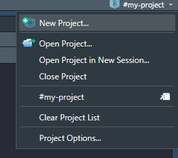
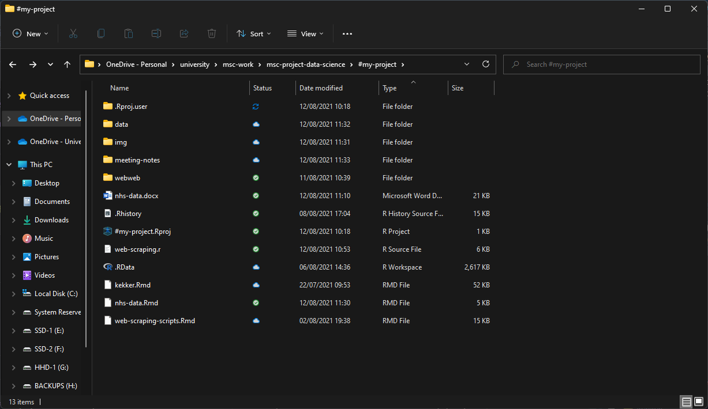

```{r setup, include=FALSE}
knitr::opts_chunk$set(
	echo = TRUE,
	message = TRUE,
	warning = FALSE
)
```

# Web Scraping NHS Wales

This report will go over the steps taken to web scrpe data from an NHS Wales website. 
This involves:

- Downloading the files into rstudio
- Carrying out some EDA
- Plotting the data
- Feature Extraction/Creation

## 0 - Set a Working Directory
Usually when working within R, I start by creating a new folder and a project file, this can be done via the gui (top right of rstudio) or via the console.




```{r}
getwd()
```

Whilst I often switch between operating systems (Linux & Windows) this isn't always an ideal way of setting the project, especially when using online cloud storage. This works much better via Git && Github.

## 1 - EDA
Firstly, when working with scripts and data science coding, it is usually very helpful to set the seed, for reproducibility.

For the seed I set it as my student number from USW - but can be anything.
```{r set-seed}
# 17076749
set.seed(17076749)
```

Next would be to set the libraries which could be useful throughout this report, most jobs within r can be done with the base set libraries, but sometimes it's fun to explore other methods which make some tasks a lot easier/faster. These packages aren't set in stone, and are dynamic for this report.

```{r install-libraries, message=FALSE, warning=FALSE, include=FALSE}
library(circlize)
library(funModeling)
library(gapminder)
library(ggplot2)
library(Lahman)
library(readxl)
library(tidyverse)
```

Next would be to import the data, this part proved to be quite difficult as I kept getting different errors when trying to download the files locally. I will add the code just in case I find something which sparks an idea.


## 1 - Meta Data

[GP Practice Analysis and Patient Registrations by Practice](https://nwssp.nhs.wales/ourservices/primary-care-services/general-information/data-and-publications/gp-practice-analysis/)

> The data shows the number of items prescribed by each practice by month and the number of patients registered with each practice. 

> Data relating to patient registrations by practice is extracted from NHAIS (National Health Application and Infrastructure Services) system each quarter. 

> The Health Board, practice code, postcode and count by age band and gender are included. Please note that patients 95 and over have been grouped together due to potential risk of disclosure.

With a better idea of the data after looking at the meta data above, this will give us a better idea of what to look for within the dataset - and a good reminder for us throughout the report.


```{r download-files-via-rstudio}
# set the url to test
url <- "https://nwssp.nhs.wales/ourservices/primary-care-services/primary-care-services-documents/gp-practice-analysis-docs/patient-registrations-july-2021" 
# notice it doesn't end with .xlsx or .xls

# set a destination of where to save the file (with extension?)
destfile <- "data/testfile"

# try to download the file with built in download.file
download.file(url,      # what to save
              destfile, # where to save
              mode="wb")# wb convert it to 2 cols

# After some more research, I found some documentation saying about how 
# difficult using XLSX files can be within R.

# browseURL('http://j.mp/2aFZUrJ')

# found a package rio 'R, Input, Output'
# will try to use this for the XLSX files.
# library(rio)
# import(url, format = "xlsx")
# rio still didn't fix the issue.
```

It looks like the download works - lets try to import the data as a dataframe and have a look - this didn't work with the built in r functions, and the package _rio_ also didn't help with this. My thought is that the file is failing to download correctly, but i'm unsure why (as I can download the package via the command line (Bash) or by clicking on it.)

```{r}
rm(df)
df <- read_excel(path = "data/testfile")
head(df)
```

This is the best I could do whilst trying to download a file from the NHS Wales website, this was done with the extension '.xlsx' and without. 
So I will download them **manually** by just clicking the links on the website and saving them to a data folder within my project.



After creating a data folder and an img folder (for screenshots), now we can read the saved datasets from that data folder with read_excel.
Doing them all at once is quite demanding, but it's not too bad.

```{r include=FALSE}
df.april20 <- read_excel("data/2020-04.xlsx", sheet = "Sheet1")
df.july20 <- read_excel("data/2020-07.xlsx", sheet = "Sheet1")
df.october20 <- read_excel("data/2020-10.xlsx", sheet = "Sheet1")
df.jan21 <- read_excel("data/2021-01.xlsx", sheet = "Sheet1")
df.april21 <- read_excel("data/2021-04.xlsx", sheet = "Sheet1")
df.july21 <- read_excel("data/2021-07.xlsx", sheet = "Sheet1")
```

Now that we have created 6 data frames each containing a month of GP visits, these are taken quarterly by the look at:
- Jan
- April
- July
- October

## 2 - Data Wrangling

Whilst these 6 datasets could be explored one at a time, lets try to combine these datasets and explore the data as a whole. First we would need to inspect the datasets to make sure they're following the same structure throughout. An easy way to check the columns is by using the function *names*.

```{r}
print(names(df.april20))
print(names(df.july20))
print(names(df.october20))
print(names(df.jan21))
print(names(df.april21))
print(names(df.july21))
```

Here we can see that the last 2 data frames have an additional column, _HAName_. From what I can tell, this is the Local Health Board which is also denoted by the OrgCode - To make things easier, lets grab the Local Health Boards, figure out which one refers to which code, and replace the code with the LHB.

To begin, lets create a data frame and get the unique Health Boards.

```{r}
# create a data frame.
df <- data.frame()
# get unique HealthBoards
uHBs <- unique(df.april21$HAName)
# print LHBs
print(uHBs)
```

Now we can see the LHBs, we can use these to filter one of the newer data frames which has the HAName/LHB.

```{r}
# Filter the last data frame with the unique health board
# as a new dataframe
my.AB <-  filter(df.july21, HAName == uHBs[1])  # Aneurin Bevan
my.BC <-  filter(df.july21, HAName == uHBs[2])  # Betsi Cadwaladr Uni
my.HD <-  filter(df.july21, HAName == uHBs[3])  # Hywel Dda
my.CV <-  filter(df.july21, HAName == uHBs[4])  # Cardiff And Vale Uni
my.CTM <- filter(df.july21, HAName == uHBs[5]) # Cwm Taf Morgannwg UHB
my.SB <-  filter(df.july21, HAName == uHBs[6])  # Swansea Bay UHB
my.PT <-  filter(df.july21, HAName == uHBs[7])  # Powys Teaching
```

Above we have filtered out the LHBs from the latest data frame, next we can check each filtered data frame for the OrgCode.

```{r}
# check if they all have a unique OrgCode
print(paste('AB = ',  unique(my.AB$OrgCode)))
print(paste('BC = ',  unique(my.BC$OrgCode)))
print(paste('HD = ',  unique(my.HD$OrgCode)))
print(paste('CV = ',  unique(my.CV$OrgCode)))
print(paste('CTM = ', unique(my.CTM$OrgCode)))
print(paste('SB = ',  unique(my.SB$OrgCode)))
print(paste('PT = ',  unique(my.PT$OrgCode)))
```

Now we know:
- 7A1 - Betsi Cadwaladr Uni
- 7A2 - Hywel Dda
- 7A3 - Swansea Bay UHB
- 7A4 - Cardiff And Vale Uni
- 7A5 - Cwm Taf Morgannwg UHB
- 7A6 - Aneurin Bevan
- 7A7 - Powys Teaching

Now that we have the HBs saved and filtered, we can drop those columns from the newer datasets, combine the datasets and then add the HBs back in (in place of the OrgCode). This is a bit over the top, and there is bound to be a better way of doing things.

```{r}
# DROP HAName
df.april21 <- df.april21[-5]
df.july21 <- df.july21[-5]
```

Here we have dropped the 5th column which is HAName. Next lets look at getting the column names from the older datasets (double check they're the same for the others) and make sure all column names are the same. 
_(I noticed the modern datasets didn't have the same capitalisation on the columns, hence the next steps.)_

```{r}
# get col names from a dataset from 2020
colNames <- names(df.april20)

# rename colnames with the same as older datasets
colnames(df.april21) <- colNames
colnames(df.july21) <- colNames
```

Before combining the datasets into something massive, lets try and create a new column for year and month (This was very difficult doing it within a loop on the joined dataset.)

```{r}
df.april20$Year <- 2020
df.april20$Month <- "April"

df.july20$Year <- 2020
df.july20$Month <- "July"

df.october20$Year <- 2020
df.october20$Month <- "October"

df.jan21$Year <- 2021
df.jan21$Month <- "January"

df.april21$Year <- 2021
df.april21$Month <- "April"

df.july21$Year <- 2021
df.july21$Month <- "July"

```

With the Year and Month cols created (and much easier than trying to run it in a conditional loop), we can merge the dfs with rbind and drop the period col.

```{r}
# Bind the datasets with rbind.
# ?rbind

df <- rbind(df.april20, df.july20, df.october20,
                df.jan21, df.april21, df.july21)
# drop Period
df <- df[-1]
```

Here we can see that the data frame was created without any issues. Lets replace the column OrgCode for the Health Board - and rename the column name afterwards. 

```{r}
# Replace OrgCode for LHBs.
df["OrgCode"][df["OrgCode"] == "7A1"] <- "Betsi Cadwaladr Uni"
df["OrgCode"][df["OrgCode"] == "7A2"] <- "Hywel Dda"
df["OrgCode"][df["OrgCode"] == "7A3"] <- "Swansea Bay UHB"
df["OrgCode"][df["OrgCode"] == "7A4"] <- "Cardiff And Vale Uni"
df["OrgCode"][df["OrgCode"] == "7A5"] <- "Cwm Taf Morgannwg UHB"
df["OrgCode"][df["OrgCode"] == "7A6"] <- "Aneurin Bevan"
df["OrgCode"][df["OrgCode"] == "7A7"] <- "Powys Teaching"
# Sanity check OrgCodes.
df$OrgCode %>% unique()
```

Lets quickly rename OrgCodes to HealthBoard so it is a bit easier to understand.

```{r}
# rename column 3
names(df)[3] = "HealthBoard"
# double check the column names
print(names(df))
```

Great - now we have a combined dataset (More datasets could be added to make things better, for example LSOA which will hopefully be explored later.) lets remove the older data frames to clear up some memory.

```{r}
# remove original datasets
remove(df.april20, df.july20, 
       df.october20, df.jan21, 
       df.april21, df.july21)
# remove filtered datasets
remove(my.AB, my.BC, my.HD, my.CV, 
       my.CTM, my.SB,my.PT)
# the other values don't need to be removed yet.
print(df$Year %>% unique())

# the other values don't need to be removed yet.
print(df$Month %>% unique())
```

This data frame could also be cleaner, to create tidy data we need 3 things:

1 - Every column is a variable
2 - Every row is an observation
3 - Every cell is a single value

This was adapted from the .
This is where I got the idea for Year and Month to be separate, but did it before the binding of the data frames above. Seeing as that part was done, lets begin some actual EDA.

## 3 - Exploratory Data Analysis

Lets now go through the dataset and get a better understanding of the structure, the data, and just explore the data.

```{r}
str(df)
```

From the structure (str) we can see that there are 9 variables with 232,292 inputs. We can also look at the data via the head and tail.

```{r}
head(df)
tail(df)
```

Along with the summary for some basic descriptive analysis.

```{r}
summary(df)
```

Summary is a very useful function as we can easily see the _min, median, mean, max_ along with some quartiles - and most importantly we can see which columns have NA's.. I'm looking at you **AgeBand**. 2365 NA's is quite a lot, so this would need to be dealt with as best as possible (this could be dropping all the values, even if it is quite a lot - or simply putting the age band as an outlier so we can easily spot them.)

```{r}
paste("There are", (df$AgeBand %>% is.na() %>% sum()), "Missing values")
# with a count of 2365 - summary was correct.
```
Even when looking at the unique values of the age, we can see that NA is in there. This could be because of a number of reasons, but there are 2 assumptions which stand out to me:

- Someone refused to give their age -- which is fine .
- They were over 94 which was stated in meta data to be grouped.

Lets now look at the unique values within each column.

- Practice Code

There are 414 unique Practice Codes

```{r}
df$PracticeCode %>% 
  unique() %>% length()
```

- Post Code

There are 390 unique PostCodes

```{r}
df$PostCode %>% 
  unique() %>% length()
```

- Health Board

There are 7 unique HealthBoards

```{r}
df$HealthBoard %>% 
  unique() %>% length()
```

- Age Band

There are 96 unique AgeBands (0:95) - These are just Ages though, we can group them later.

```{r}
df$AgeBand %>% 
  unique() %>% length()
```

- MaleCount

There are 235 unique MaleCount entries (Not sum or count)

```{r}
df$MaleCount %>% 
  unique() %>% length()
```

- FemaleCount

There are 364 unique FemaleCount entries (Not sum or count)

```{r}
df$FemaleCount %>% 
  unique() %>% length()
```

- IndeterminateCount

There are 2 unique IndeterminateCount entries (These could be intersex??) and binary (0 = F, 1 = T?)

```{r}
df$IndeterminateCount %>% 
  unique() %>% length()
```

- Count

There are 596 unique entries for count (Not sum or count)

```{r}
df$Count %>% 
  unique() %>% length()
```


- Year

There are 2 unique entries for Year

```{r}
df$Year %>% 
  unique() %>% length()
```

- Month

There are 4 unique entries for Month

```{r}
df$Month %>% 
  unique() %>% length()
```


Before moving on, it's important to do something with the missing values within the AgeBand - this can be done by replacing the values with the mean value or just changing them to 0's. Here, lets change them to the mean value.

```{r}
df$AgeBand[is.na(df$AgeBand)] <- mean(df$AgeBand, na.rm=TRUE)
```

Whilst some of the code above didn't really show anything which stood out (mainly the unique counts) - there are many packages which I found when researching EDA in R with this one below being _skimr_ which is great for a Data Summary.

```{r}
# https://www.rdocumentation.org/packages/skimr/versions/2.1.3
library(skimr)

df %>% skim()
```


```{r}
df %>% 
  skim_without_charts(is.numeric)
```

We can also try to uncover some descriptive statistics using the package funModeling - this adds a few fun functions which show off the data in a different way again (similar to the above package.)

```{r}
# we can produce some descriptive stats with profiling_num.
profiling_num(df)
# print to check the status of the dataframe
status(df)
```

As we saw with the 2 functions (profiling and status) the dataset can be seen as a whole which sometimes can be overwhelming, especially within data science.

So the next part demonstrates how to get some descriptive statistics from the base r packages.

```{r}
mean(df$MaleCount)
# The mean MaleCount is 41.08
mean(df$FemaleCount)
# The mean FemaleCount is 41.27
# This would suggest more Females get seen than men.
```


```{r}
# Can we look at who saw the most people on avg,
# via org code?
orgPerP <- aggregate(formula = Count ~ HealthBoard,
                     data = df,
                     FUN = mean)

orgPerP
```

From the above we can see that Cwm Taf had the highest mean count compared to the other LHBs - which is interesting as I don't think it even covers the biggest area.

This was a very quick look at the data - next we want to try and pull out some more insights from this dataset. This can be done by looking at the percentages of the data and trying to plot it for a better picture.

## 4 - Plots

This section will look to explore the dataset and produce some plots - this will use a range of packages from base r packages (plot, barplot etc), ggplot, funModeling and more.

```{r}
# frequency looks at plotting some of the numerical data
freq(df)
```

The freq function from the funModeling package is great to quickly look at the frequencies in the dataset and creates some plots for us - with the Health Board Frequency plot looking very interesting.

```{r}
# numerical profiling in one function 
# automatically excludes non-numerical variables
plot_num(df)
```

plot_num plots all of the numerical values within a dataset and plots them nicely, although this plot isn't too interesting to us in this form. 

Lets try to look at the average visits per GP.

```{r}
lhbs <- orgPerP$HealthBoard

plot(x = orgPerP$Count,
     main = "Avg Age seen per HealthBoard",
     xlab = "Local Health Board",
     ylab = "Average Age",
     type = "b")

pp <- ggplot(orgPerP, 
             aes(Count, 
                 HealthBoard,
                 colour = HealthBoard)) +
  geom_point(aes(size=6)) + 
  labs(title = "Average Age Seen Per Health Board", 
       subtitle = "From 2020 - 2021")
pp
```


```{r}

# drop colum 3
mfPerc <- genders[-3]

malePer <- 9686953/232292
femalePer <- 9738294/232292  

# create an empty df
mfPerc1 <- c(malePer, femalePer)


#
barplot(mfPerc1, main="Total Visits Per Gender",
        xlab = "Gender", ylab = "Count", las=1,
        col=c("Blue", "Pink"), names=c("Male","Female"))


mfPerc1

```

The barplot shows the percentage split of males and females which saw their GP in the last 2 years, obviously it is important to keep in mind that since Covid hit, a lot of GPs stopped tracking their visits as closely. 

The split was 

- Males: 41.70 
- Females: 41.92

with intersex being _0.0004_ which is why it was omitted.


Data Science Live Book - Pablo Casas - January 2019
This could also be done with a script and a few packages
source: https://blog.datascienceheroes.com/exploratory-data-analysis-in-r-intro/
accessed 05/08/2021


```{r}
# write out the data frame to end.
# write.csv(df, file = "data/gp-visits-lhb.csv")


# 3 - Plots ####


# 4 - Hypothesis Testing ####
# Not sure what to do here?


# Can we look at demand over time
# Look at plotting the Genders / Age (gender per area)
# Link LSOA to existing Data sets
# Can look at Most Popular Visit per Age?
# what proportion of females went out of the whole pop
# Which would be count/sum(malecount) + sum(femalecount)
# Or just for that GP actually
# Which would be count/malecount + femalecount

# Create an empty df.


```

```{r}
status(df)
df_status(df)
discretize_get_bins(df)
freq(df)
get_sample(df)
plot_num(df)
profiling_num(df)
```

